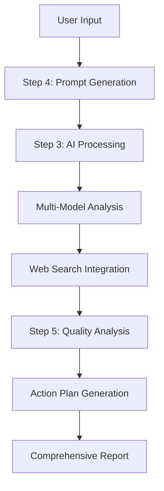

# 🔬 ResearchForge

> **AI-Powered Research & Development Pipeline with Automated Quality Assurance**

[](https://python.org)
[](LICENSE)
[](#stepforge-methodology)
[](https://llama.com)
[](#gui-interface)

---

## 🚀 What is ResearchForge?

ResearchForge is a next-generation AI research pipeline that automates the entire research-to-implementation workflow. Unlike simple chatbots, ResearchForge provides a structured, auditable approach to AI-assisted development with built-in quality assurance, multi-model validation, and automated code analysis.

### 🎯 **Problem We Solve**
- **Manual Research is Slow**: Traditional research workflows are time-consuming and error-prone
- **AI Output Quality**: Single AI models can produce inconsistent or unreliable results
- **No Quality Control**: Most AI tools lack built-in code review and testing
- **Poor Traceability**: Difficult to audit and reproduce AI-generated research

### ✨ **Our Solution**
ResearchForge implements the **StepForge methodology** - a systematic approach to AI-driven development that ensures quality, traceability, and reproducibility at every step.

---

## 🌟 Key Features

### 🤖 **Multi-Model AI Integration**
- **Dual LLaMA Model Validation**: Cross-validates results using multiple AI models
- **Intelligent Prompt Engineering**: Optimized prompts for research and development tasks
- **Web Search Integration**: Automated DuckDuckGo searches for real-time information

### 🔍 **Automated Quality Assurance**
- **Code Linting**: Automatic PEP8 compliance checking with flake8
- **Dependency Analysis**: Smart detection of missing packages and installation suggestions
- **Automated Testing**: Built-in test execution and result analysis
- **Code Relevance Checking**: Validates that generated code matches user intent

### 📋 **Comprehensive Reporting**
- **Action Plans**: Detailed analysis with improvement suggestions
- **Markdown Summaries**: Professional documentation generation
- **Resource Recommendations**: Curated learning resources based on your project
- **Alternative Direction Suggestions**: Creative pivots and extensions

### 🖥️ **Professional GUI Interface**
- **Windows PowerShell GUI**: Easy-to-use interface for non-technical users
- **File Management**: Built-in browser for all pipeline outputs
- **System Monitoring**: Real-time status and dependency checking
- **Pipeline Orchestration**: One-click execution of complete workflows

### 🔄 **StepForge Methodology**
- **Numbered Steps**: Clear, auditable workflow with step-by-step execution
- **Atomic Operations**: Each step is independent and reusable
- **Version Control**: Built-in tracking with unique identifiers
- **Extensible**: Easy to add new steps or modify existing ones

---

## 🏃‍♂️ Quick Start

### Prerequisites
- Python 3.8+
- LLaMA API access
- Windows (for GUI) or any OS (for CLI)

### 1. Clone & Install
```bash
git clone https://github.com/yavru421/ponder_llama.git
cd ponder_llama
```

### 2. Windows Users (Recommended)
```batch
# Setup everything
setup.bat

# Run the GUI
run.bat
```

### 3. Alternative Setup Methods
```powershell
# PowerShell (Advanced)
.\tasks.ps1 setup
.\tasks.ps1 gui

# Python (Cross-platform)
python tasks.py setup
python tasks.py pipeline

# NPM (If you have Node.js)
npm run setup
npm run gui
```

### 4. Environment Setup
```bash
# Set your LLaMA API key
set LLAMA_API_KEY=your_api_key_here

# Optional: Custom output directory
set PONDER_LLAMA_OUTPUT_DIR=custom_output

# Optional: Max conversation turns (5-10)
set PONDER_LLAMA_MAX_TURNS=7
```

---

## 🏗️ Architecture Overview

ResearchForge follows the **StepForge methodology** with clearly defined, numbered steps:



### Core Components

| Component | Purpose | Technology |
|-----------|---------|------------|
| **four_promptgen.py** | Interactive prompt generation | Python CLI |
| **3.py** | AI conversation orchestration | LLaMA API, DuckDuckGo |
| **five_action.py** | Quality analysis & reporting | Multi-model validation |
| **module4.py** | Prompt management | UUID tracking |
| **module_common.py** | Shared utilities | Atomic file operations |
| **ponder_llama_gui.ps1** | Windows GUI interface | PowerShell Forms |

---

## 📖 Usage Examples

### Research a Technical Topic
```python
# Example: Quantum Computing Research
goal = "Research quantum computing fundamentals and implement a basic qubit simulator"
negatives = "No theoretical-only content, avoid complex mathematics"
tools = "Web search, academic papers, code examples"
search_terms = "quantum computing, qubits, superposition, Python simulation"
```

### Generate a Software Project
```python
# Example: Build a Todo API
goal = "Create a RESTful API for task management with FastAPI"
negatives = "No basic CRUD only, include authentication"
tools = "FastAPI, SQLAlchemy, JWT authentication"
search_terms = "FastAPI tutorial, REST API design, authentication"
```

### Analyze Existing Code
```python
# Example: Code Review and Improvement
goal = "Analyze and improve the performance of this data processing script"
tools = "Code analysis, performance profiling, optimization techniques"
# Include your code in the context folder
```

---

## 🤝 Contributing

We welcome contributions! See [CONTRIBUTING.md](.github/CONTRIBUTING.md) for guidelines.

### Quick Development Setup
```bash
git clone https://github.com/yavru421/ponder_llama.git
cd ponder_llama
python tasks.py setup
python tasks.py dev-install
```

---

## 📊 Why ResearchForge?

| Feature | ResearchForge | ChatGPT | GitHub Copilot | Traditional Research |
|---------|---------------|---------|----------------|---------------------|
| **Multi-Model Validation** | ✅ | ❌ | ❌ | ❌ |
| **Automated QA** | ✅ | ❌ | ❌ | ❌ |
| **Web Search Integration** | ✅ | Limited | ❌ | Manual |
| **Code Analysis** | ✅ | Basic | ✅ | Manual |
| **Audit Trail** | ✅ | ❌ | ❌ | Limited |
| **Structured Methodology** | ✅ | ❌ | ❌ | Varies |
| **Windows-Native Tools** | ✅ | ❌ | ❌ | ❌ |

---

## 📄 License

This project is licensed under the MIT License - see the [LICENSE](LICENSE) file for details.

---

## 🙏 Acknowledgments

- **StepForge Methodology** created by John Daniel Dondlinger
- **LLaMA API** by Meta AI for powering our AI capabilities
- **DuckDuckGo** for privacy-focused web search integration
- **Python Community** for the excellent ecosystem of tools

---

<div align="center">
  <h3>🚀 Ready to revolutionize your research workflow?</h3>
  <p>
    <a href="#quick-start">Get Started</a> •
    <a href="QUICKSTART.md">Quick Guide</a> •
    <a href=".github/CONTRIBUTING.md">Contribute</a> •
    <a href="STEPFORGE.md">Learn StepForge</a>
  </p>

  **⭐ Star this repo if you find it useful!**

  <sub>Built with ❤️ using the StepForge methodology</sub>
</div>